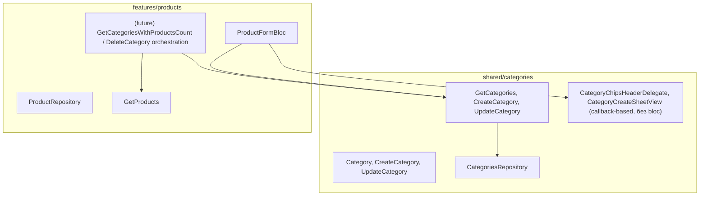

# Архитектура: категории (shared) ↔ продукты (feature)

## Диагноз текущего состояния

- `lib/shared/categories/` — только чтение (`GetCategories`), нет `create/update` в `CategoriesRepository`, хотя entities/models (`CreateCategory`, `UpdateCategory`) уже заведены.
- `GetCategories` зарегистрирован в [product_di.dart](lib/features/products/di/product_di.dart), хотя не имеет никакого отношения к products — это чисто categories-usecase.
- В [product_local_data_source.dart](lib/features/products/data/data_sources/product_local_data_source.dart) осталась мёртвая копия `getCategories()` + закомментированный CRUD — дубликат того, что уже переехало в shared.
- [category_create_sheet.dart](lib/shared/categories/presentation/widgets/category_create_sheet.dart) — кнопка «Добавить» ничего не делает (`onPressed: () {}`).
- В [product_form_view.dart](lib/features/products/presentation/form/views/product_form_view.dart) секция категории — это просто кнопка "Создать категорию", нет списка для выбора, нет bloc.
- Подсчёт количества продуктов в категории уже решён паттерном в products: `CategoryProduct.groupByCategories(categories, products)` в [category_product.dart](lib/features/products/domain/entities/category_product.dart) — считает на основе `product.categoryId == category.id`, но **дропает категории без продуктов** (не подходит для экрана управления категориями, где нужно показывать и пустые категории).

Главный принцип, который решает путаницу: **`shared/categories` никогда не должен знать о продуктах.** Всё, что требует знания "сколько товаров привязано" или "что делать при удалении" — это факт о **products**, а не о categories, и должно жить в `features/products` как отдельный usecase/bloc, который _использует_ shared categories usecases, а не наоборот.



Стрелки идут только в одну сторону: products зависит от shared/categories, но не наоборот. Подсчёт количества и логика удаления — это **новый usecase в products**, который дополнительно дёргает `ProductRepository`, а не расширение `Category`/`CategoriesRepository`.

## Часть A — Достроить shared/categories (чистый CRUD, без products)

1. [categories_local_data_source.dart](lib/shared/categories/data/data_sources/categories_local_data_source.dart): добавить `createCategory(CreateCategoryModel)`, `updateCategory(UpdateCategoryModel)` (логика уже набросана и закомментирована в `product_local_data_source.dart` — перенести и адаптировать сюда, там удалить).
2. `CategoriesRepository` + `CategoriesRepositoryImpl`: добавить `createCategory`/`updateCategory` → `Either<Failure, Category>`.
3. Новые usecases в `lib/shared/categories/domain/usecases/`: `create_category.dart`, `update_category.dart` (по образцу `get_categories.dart`), экспортировать в `usecases.dart`.
4. [categories_di.dart](lib/shared/categories/di/categories_di.dart): зарегистрировать здесь `GetCategories`, `CreateCategory`, `UpdateCategory` — убрать регистрацию `GetCategories` из `product_di.dart`.
5. Убрать дублирующийся `getCategories()`/закомментированный CRUD из [product_local_data_source.dart](lib/features/products/data/data_sources/product_local_data_source.dart) — у products своей копии категорий больше нет.
6. [category_create_sheet.dart](lib/shared/categories/presentation/widgets/category_create_sheet.dart): `showCategoryCreateSheet` принимает `required void Function(String label, String iconKey) onCreate`; кнопка «Добавить» валидирует форму и зовёт `onCreate(...)`. Виджет остаётся bloc-agnostic — как уже сделано в `CategoryChipsHeaderDelegate` (только данные + callback-и).

## Часть B — ProductFormBloc в features/products

Это отвечает на вопрос "где создавать bloc и где его пробрасывать".

1. Новая папка `lib/features/products/presentation/form/bloc/` (по структуре `catalog/bloc/`: `product_form_bloc.dart`, `product_form_event.dart` (part), `product_form_state.dart` (part), `bloc.dart` barrel).
   - Зависимости конструктора: `GetCategories` и `CreateCategory` (обе из **shared**).
   - State: `categories: List<Category>`, `selectedCategory: Category?`, `isLoading`, `error`.
   - Events: `ProductFormCategoriesRequested({Product? product})` — грузит категории и, если это редактирование, предвыбирает `selectedCategory` по `product.categoryId`; `CategorySelected(Category category)`; `CategoryCreateRequested(String label, String iconKey)` — вызывает `CreateCategory`, при успехе добавляет категорию в `state.categories` и сразу выбирает её.
2. [product_form_page.dart](lib/app/pages/product_form_page.dart): оборачивает `ProductFormView` в `BlocProvider`, создавая bloc через `getIt` — точно так же, как уже сделано в [product_catalog_page.dart](lib/app/pages/product_catalog_page.dart):

```dart
BlocProvider(
  create: (_) => ProductFormBloc(
    getCategories: getIt.get<GetCategories>(),
    createCategory: getIt.get<CreateCategory>(),
  )..add(ProductFormCategoriesRequested(product: product)),
  child: ProductFormView(product: product),
)
```

3. [product_form_view.dart](lib/features/products/presentation/form/views/product_form_view.dart): секция категории превращается в `BlocBuilder<ProductFormBloc, ProductFormState>`:
   - Список `SelectableChip` по `state.categories` (тот же виджет, что уже используется в каталоге), `selected: state.selectedCategory?.id == category.id`, `onSelected: (_) => context.read<ProductFormBloc>().add(CategorySelected(category: category))`.
   - Кнопка "Создать категорию" передаёт `onCreate` замыкание, где уже захвачен `context.read<ProductFormBloc>()` **из контекста формы** (до открытия шторки):

```dart
showCategoryCreateSheet(
  context,
  onCreate: (label, iconKey) => context
      .read<ProductFormBloc>()
      .add(CategoryCreateRequested(label: label, iconKey: iconKey)),
);
```

### Почему именно так решается "пробрасывание" bloc в шторку

`showCategoryCreateSheet` вызывает `showModalBottomSheet`, который пушит **новый route** — его поддерево не является потомком `BlocProvider`, стоящего в `ProductFormPage`, поэтому `context.read<ProductFormBloc>()` внутри шторки напрямую не сработает. Решение — **не пробрасывать bloc в шторку вообще**: шторка остаётся чистым UI с callback-параметром, а сам `bloc` резолвится в замыкании ещё во внешнем (form) context, до открытия модалки. Это тот же паттерн, что уже используется для `CategoryChipsHeaderDelegate` (`onCategorySelected` callback) — просто применяем его последовательно и для шторки создания категории.

## Часть C — куда позже уедет подсчёт количества и удаление категории (не реализуем сейчас, но фиксируем контракт)

- Экран управления категориями (список карточек со счётчиком, редактирование, удаление) должен жить в **`features/products/presentation/categories_management/`**, а не в `shared/categories/presentation` — потому что ему нужно знать про products.
- Подсчёт: новый usecase `GetCategoriesWithProductsCount` в `lib/features/products/domain/usecases/`, который внутри параллельно зовёт shared `GetCategories` + свой `GetProducts` и мапит в новую entity `CategoryProductsCount { Category category; int productsCount; }` (в `features/products/domain/entities/`). В отличие от `CategoryProduct.groupByCategories`, здесь **не фильтруются категории с нулевым количеством** — на экране управления они должны быть видны (иначе нельзя понять, что категорию можно спокойно удалить).
- Удаление категории (политика: **запрет удаления, если есть привязанные продукты**, показываем предупреждение с количеством): отдельный usecase `DeleteCategory` в `features/products/domain/usecases/`, который сначала проверяет количество через `ProductRepository`/`GetCategoriesWithProductsCount`, и только при `count == 0` вызывает `DeleteCategory` из shared (нужно будет доб��вить и туда). Эта оркестрация принципиально не может жить в `shared/categories`, т.к. требует знания о products — но и не должна быть разбросана по виджетам, поэтому оформляется как usecase в products/domain.
- Редактирование категории (label/иконка) — не требует знания о products (`categoryId` не меняется), поэтому просто использует shared `UpdateCategory` без доп. оркестрации.

## Известное инфраструктурное ограничение (не блокирует архитектуру, но нужно будет починить)

`Hive.box<CategoryModel>("categories")` / `Hive.box<ProductModel>("products")` вызываются без предварительного `Hive.openBox` и без зарегистрированных `TypeAdapter` ни в [hive_initializer.dart](lib/core/storage/hive_initializer.dart), ни в [core_scope.dart](lib/app/di/core_scope.dart). Сейчас `getCategories()`/создание категории будут тихо возвращать `CacheFailure`. Это отдельная инфраструктурная задача (открыть боксы + сделать модели `@HiveType` или зарегистрировать JSON-адаптеры) — фиксирую здесь, чтобы не забыть перед тестированием реального сохранения.

## Итоговый список задач (только выбор категории в форме — по договорённому скоупу)

</plan>
<todos>[{"id": "shared-crud", "content": "Добавить create/update в CategoriesLocalDataSource, CategoriesRepository + usecases CreateCategory/UpdateCategory в shared/categories, зарегистрировать в categories_di.dart"}, {"id": "cleanup-dup", "content": "Удалить дублирующийся getCategories()/закомментированный CRUD из features/products/data/data_sources/product_local_data_source.dart и регистрацию GetCategories из product_di.dart"}, {"id": "sheet-callback", "content": "Переделать showCategoryCreateSheet/CategoryCreateSheetView на callback onCreate(label, iconKey) вместо пустого onPressed"}, {"id": "form-bloc", "content": "Создать ProductFormBloc (+event/state) в features/products/presentation/form/bloc, зависящий от shared GetCategories и CreateCategory"}, {"id": "wire-page", "content": "Обернуть ProductFormView в BlocProvider<ProductFormBloc> внутри ProductFormPage по аналогии с ProductCatalogPage"}, {"id": "wire-view", "content": "Добавить в product_form_view.dart список SelectableChip категорий + подключить onCreate шторки к context.read<ProductFormBloc>()"}]</todos>
